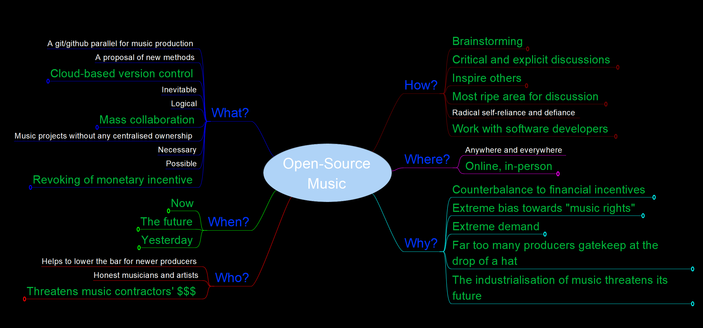
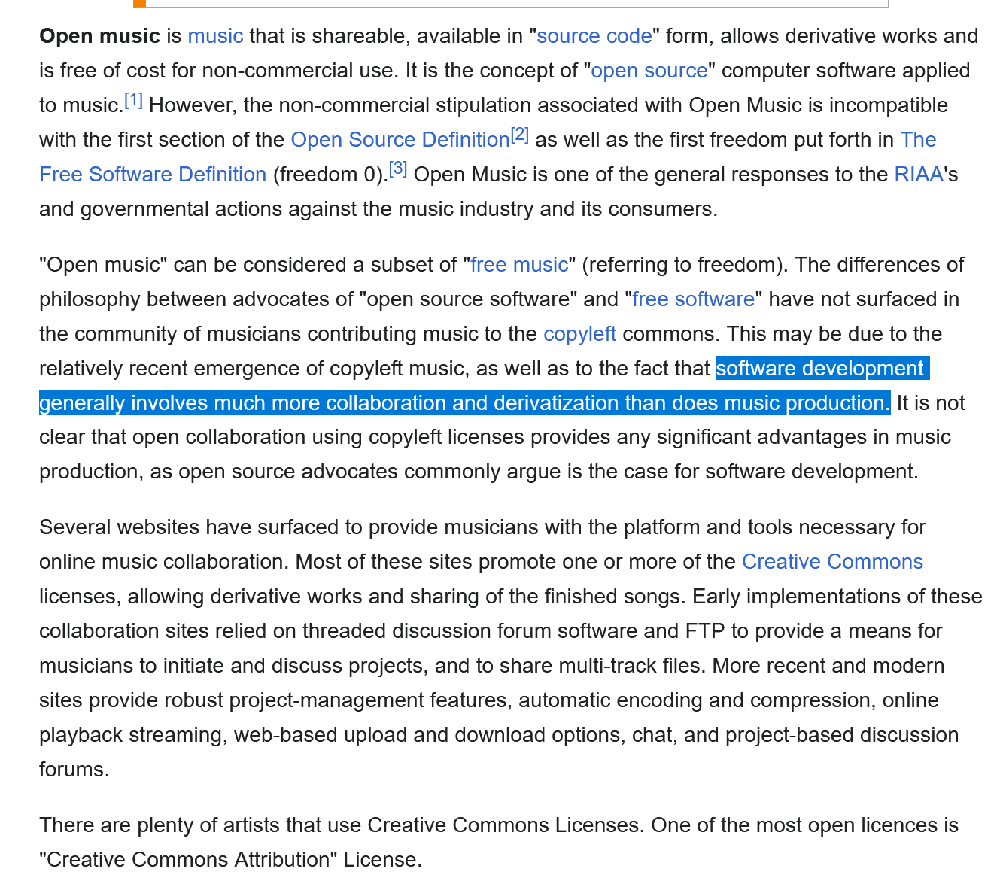

# stem
>"StemHub"

A git/GitHub parallel for open-source music production, currently in a pure ideation or "pre-development" phase.

- I hope to decentralise this developement simply because I (v3i1ix) am a novice programmer, and together this can be developed much faster.
- But, either way, I will see to it that it is developed, or die trying, really... just might take longer, is all.

## Mindmap Excerpt

## Download and Edit the Mindmap
1. **Download & Install Freeplane:** The initial mindmaps were made using Freeplane, which is a free and open-source software. You can download Freeplane from their official site  [here](https://docs.freeplane.org/getting-started/getting-started.html).
2. **Download the Mindmap:** Once you have installed Freeplane, clone the repository, or simply download the .mm file from the latest release.
3. **Open the Mindmap:** Open the mindmap in Freeplane and edit/view.
4. **Submit your own version:** Submit a pull request with your modified changes.

## A Curious Quote

